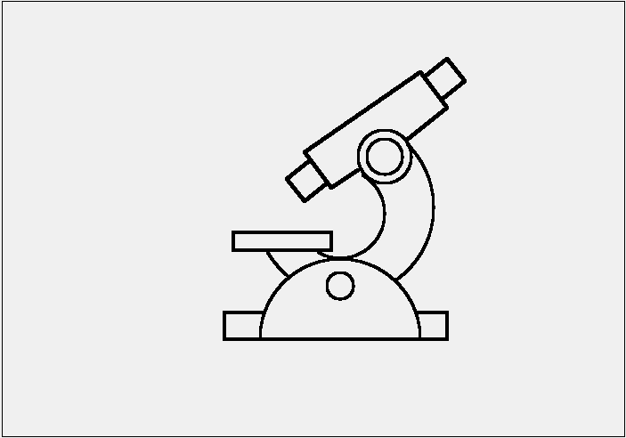
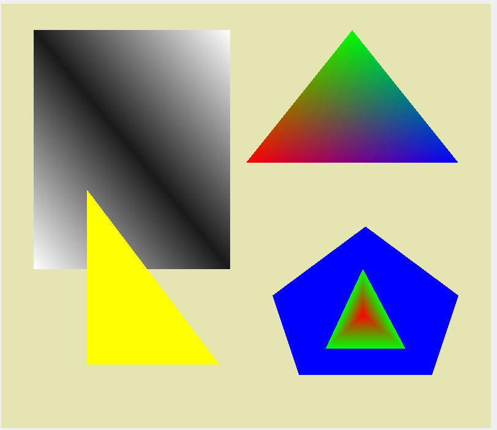

# Computer Graphics

Two small C++ / Qt desktop programs written for the Computer Graphics course at
Palestine Polytechnic University.
Each one opens a window and draws a picture.

| Program | What it draws | How it draws it |
| --- | --- | --- |
| [Microscope](#microscope) | A microscope made of lines, circles and arcs | Pixel by pixel, with classic scan-conversion algorithms |
| [OpenGL shapes](#opengl-shapes) | Colored triangles, a rectangle and a pentagon | With OpenGL, letting the graphics card blend the colors |

## Microscope



The program never asks Qt to "draw a line". It decides itself which pixels to turn on,
using classic scan-conversion algorithms:

| Shape | Algorithm | Idea in one sentence |
| --- | --- | --- |
| Line | DDA | Walk along the longer axis one pixel at a time and add the slope to the other axis. |
| Line | Bresenham | Same result as DDA but with whole numbers only, by tracking an error term. |
| Circle | Midpoint | Compute one eighth of the circle and mirror it to get the other seven. |
| Arc | Parametric | Step the angle so each step moves about one pixel along the arc. |

The algorithms live in [`rasterizer/Rasterizer.cpp`](rasterizer/Rasterizer.cpp) and the microscope itself
is a list of shapes at the top of [`rasterizer/RenderWidget.cpp`](rasterizer/RenderWidget.cpp).

## OpenGL shapes



Every corner of a shape is given a color and OpenGL fills in the colors in between,
which produces the gradients. The shapes are listed in
[`opengl-shapes/RenderWidget.cpp`](opengl-shapes/RenderWidget.cpp).

## Keyboard shortcuts

Both programs share the same window:

| Key | Action |
| --- | --- |
| `Ctrl+S` (`Cmd+S` on macOS) | Save the picture as a PNG file |
| `Esc` | Close the window |

Resize the window and the picture resizes with it.

## Build and run

You need three things:

- a C++17 compiler (Visual Studio, Xcode command line tools, or GCC)
- [CMake](https://cmake.org/download/) 3.16 or newer
- [Qt](https://www.qt.io/download-open-source) 5 or 6

Installing them:

| System | Command |
| --- | --- |
| macOS | `brew install cmake qt` |
| Ubuntu / Debian | `sudo apt install build-essential cmake qt6-base-dev libgl1-mesa-dev` |
| Windows | Install Qt with the Qt online installer, and CMake from cmake.org |

Then, from the repository folder:

```sh
cmake -S . -B build
cmake --build build
```

If CMake cannot find Qt, tell it where Qt is installed, for example
`cmake -S . -B build -DCMAKE_PREFIX_PATH=C:/Qt/6.7.0/msvc2019_64`.

Run the programs:

```sh
./build/rasterizer/microscope
./build/opengl-shapes/shapes
```

With Visual Studio the programs end up in a `Debug` or `Release` subfolder,
for example `build\rasterizer\Debug\microscope.exe`.

You can also open the top-level `CMakeLists.txt` directly in Qt Creator, Visual Studio or CLion
and press Run.

### Tests

The drawing algorithms have tests that check, for example, that lines have no gaps in any
direction and that circle pixels really are on the circle:

```sh
ctest --test-dir build --output-on-failure
```

On Visual Studio add `-C Debug`.

## Project layout

```
CMakeLists.txt        builds everything
common/               the window shared by both programs (shortcuts, screenshot)
rasterizer/
  Rasterizer.*        line, circle and arc algorithms (no Qt needed)
  RenderWidget.*      the microscope scene
  tests/              tests for the algorithms
opengl-shapes/
  RenderWidget.*      the OpenGL shapes
```

## Contributors

- **Amro Amro** ([@AMROAMRO404](https://github.com/AMROAMRO404)) – author
- **Zein Salah**, Palestine Polytechnic University – original course framework these programs started from

## License

Parts of the code come from the Palestine Polytechnic University course framework. Its notice, kept at the top of the
source files, allows use and modification for academic purposes as long as the notice stays.
